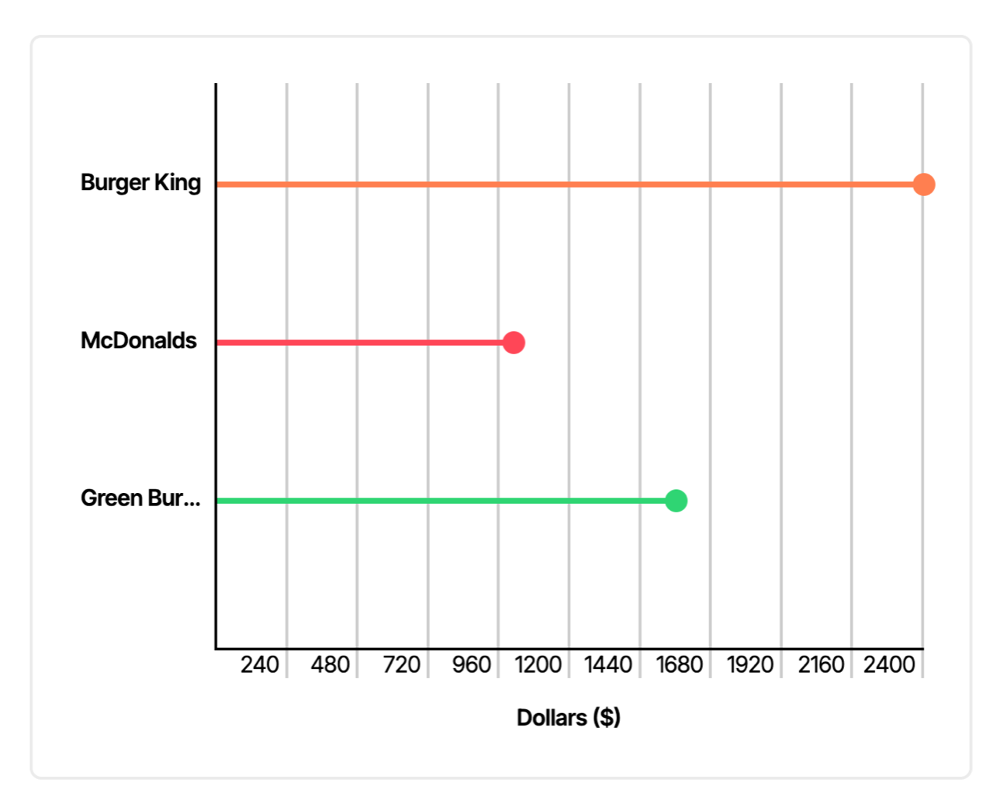

<p align="center">
  
</p>

# PureChart
Fully customizable HTML/CSS charts for Ruby on Rails. PureChart serves as an alternative to other charting libraries that extensively use JavaScript and HTML `canvas` elements to render charts, resulting in Rails rendering problems and very limited customization options.

## Examples
### Lollipop Chart
#### Controller
```ruby
class ChartsController < ApplicationController
    def index
        @data = [
            {
                name: "Burger King",
                color: "#ff7f50",
                dollars: 1200
            },
            {
                name: "McDonalds",
                color: "#ff4757",
                dollars: 500
            },
            {
                name: "Green Burrito",
                color: "#2ed573",
                dollars: 780
            }
        ]
    end
end
```
#### Template
```erb
<div class="card">
    <%= lollipop_chart %>
</div>
```
<p align="center">
  
</p>
